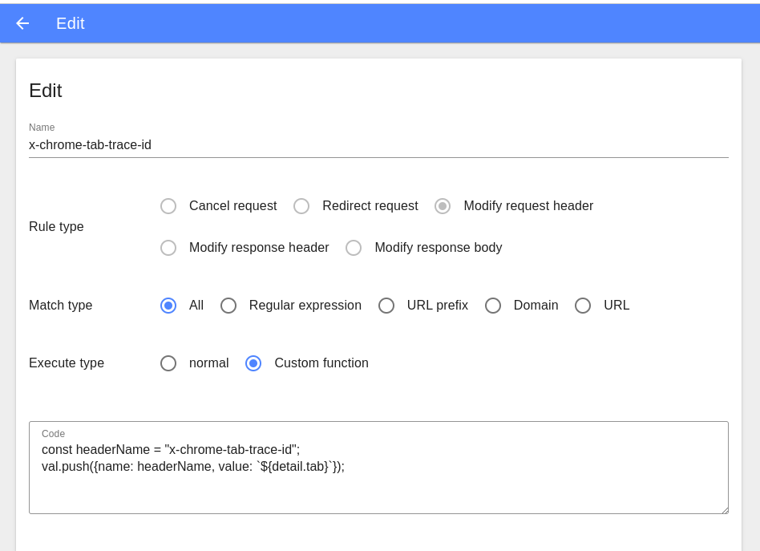
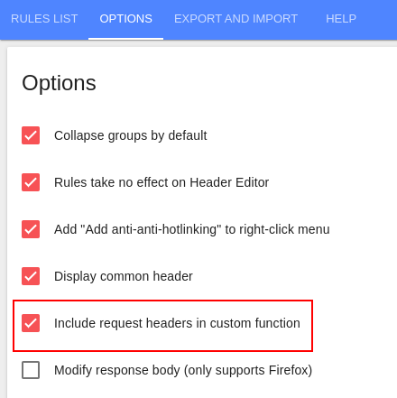
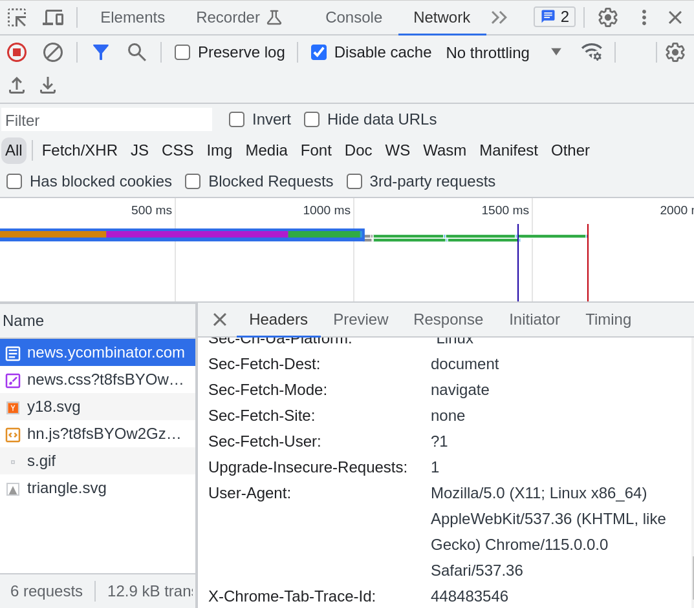

# add trace id to request header using chrome extension

## why

To trace requests prefetch, we need to group requests by some kind of id,
which represents a page view trace tree.

Chrome's tab is a good choice, so we want to attach it into every request header.

## modify req header

Header Editor (open source)

- https://chrome.google.com/webstore/detail/header-editor/eningockdidmgiojffjmkdblpjocbhgh
- https://github.com/FirefoxBar/HeaderEditor

Support exectute javascript code to modify request headers

Doc: https://github.com/FirefoxBar/HeaderEditor/blob/master/docs/docs/guide/custom-function.md

The function sig is:

```
// val: request header obj if you wanna modify request
// detail: some request detail info
function(val, detail) {
  // ...
}
```

But it does not support async function, issue: https://github.com/FirefoxBar/HeaderEditor/issues/90

So we could not use chrome extensions api like `chrome.tabs.query()` to query current the tab url.

## usage

1. install Header Editor
2. create rule as:

3. add source code below to text area
4. enable `include request headers in custom function` in options pages as:

5. then in devtool we could see the header is added:


## source code

```javascript
const headerName = "x-chrome-tab-trace-id";
val.push({name: headerName, value: `${detail.tab}`});
```